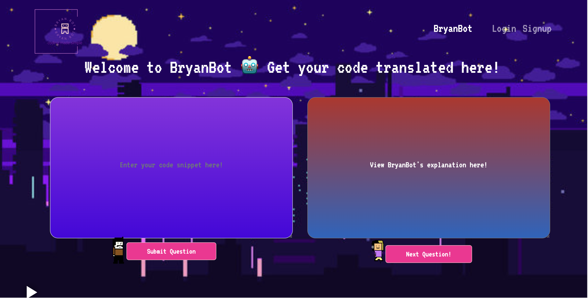
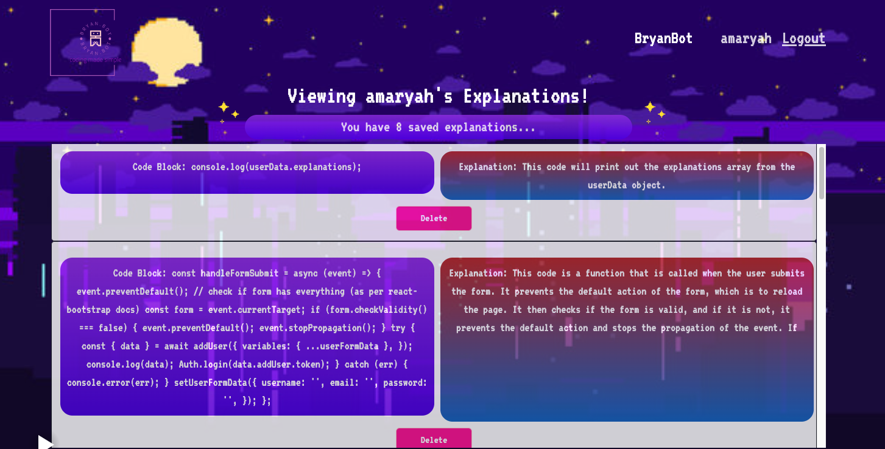

# BryanBot Model 1

## [Deployed Application](https://bryanbot.herokuapp.com/)

## [](https://opensource.org/licenses/MIT)

## Description
BryanBot is a MERN stack application powered by OpenAI that allows users to write blocks of codes and receive plain English translation in return, as well as save their questions and responses for future reference.

## Table of Contents
- [Installation](#installation)
- [Usage](#usage)
- [Credits](#credits)
- [License](#license)
- [Contributing](#contributing)
- [Tests](#tests)
- [Questions](#questions)

## Installation
To view and interact with the application, visit the application's url in any browser. <br>
To install the application locally, ensure that [Node.js](https://nodejs.org/en/download/) and [MongoDB](https://www.mongodb.com/docs/manual/administration/install-community/) are installed, then clone the repository from Github. Create an [OpenAI](https://platform.openai.com/) API key and add it to a .env file, then run the installation script ```npm run install``` followed by the start script ```npm run develop```. To view the application, visit http://localhost:3000/.

## Usage
Upon opening the application, the user is presented with the 'BryanBot' homepage with an instruction banner explaining that BryanBot's purpose is to take code blocks and explain them in plain English, and save the user's query history. If the user wants to use BryanBot, they make create an account or log in with a pre-existing account. After logging in, the user can view their past question/response data and navigate to BryanBot to make a query. To use BryanBot, type or paste a code block into the left-most block and click the Submit button. The question is sent to the AI and the user awaits the response. The user will then receive the AI's translation on the right-most block and can view their saved query in their Profile page.
<br>



## Credits
### Developers:
- [Allie Ang](https://github.com/Allie-Ang) <br>
- [Amaryah Wolf](https://github.com/amaryahwolf) <br>
- [Sky Kim](https://github.com/sjk777) <br>
- [Vanessa Chan](https://github.com/vchan852) <br>

### Technologies Used:
- React
- Express
- Node
- GraphQL
- Mongoose
- Apollo Client
- OpenAI
- React Bootstrap
- Bootstrap
- Google Fonts
- Framer Motion
- React Player
- Font Awesome

## License
This application is covered under the MIT license.

## Contributing
[Contributor Covenant](https://www.contributor-covenant.org/version/2/1/code_of_conduct/)

## Tests
N/A

## Questions
For questions, please reach us at our Githubs linked above under Credits.